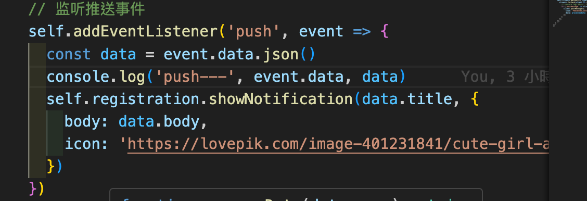

### start websocket

```bash
1. python3 websocket_server.py
2. npm run dev
```

### use service-worker

使用 service-worker fetch，获取的 urlsToCache 的缓存资源


使用 `postMessage` API在主线程和Service Worker之间来回传递的。

service worker 主要用于网路请求的拦截和管理，因此对于复杂的数据处理任务，建议还是在主线程（或web worker）中处理。

Service Worker与主线程之间的通信是异步的，因此需要考虑处理时许和数据同步问题。


#### sw接收server推送的数据

```bash
# 根目录下运行，可以接收server端 push来的数据
python3 websocket_server.py
node ./node_server_sw/sw_push_node.js
```


